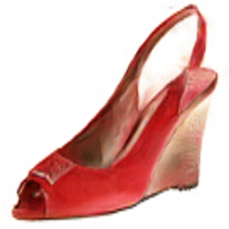
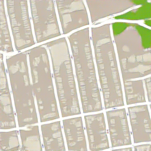

# pix2pix 
- Tensorflow implementation of [
Image-to-Image Translation with Conditional Adversarial Networks](https://arxiv.org/abs/1611.07004) (CVPR 2017)
- The conditional adversarial network is trained to learn the image-to-image mapping.
- The generator is a U-Net (a encoder-decoder with skip layers), since the input and output may share low level features for some tasks (i.e. image colorizaton).
- The discriminator is used to classify if a image patch is real or fake (PatchGAN). Because L1 loss forces the low-frequency correctness (blurred images) and it is sufficient for discriminator to focus on high-frequency structure locally. Then the output of discriminator is averaged over all the patches in the image. Another advantage of using PatchGAN is that it has fewer parameters than full size GAN and can be applied to arbitrary size images.
- Additional L1 loss is added to generator loss to make the generated image near the groundtruth. L1 loss is chosen because it is less encourage blurring images than L2 loss as mentioned in section 3.1 of the paper.

## Requirements
- Python 3.3+
- [Tensorflow 1.9+](https://www.tensorflow.org/)
- [Numpy](http://www.numpy.org/)
- [Scipy](https://www.scipy.org/)

## Implementation Details
- The pix2pix model is defined in [`lib/model/pix2pix.py`](lib/model/pix2pix.py). An example of how to use this model can be found [`experiment/pix2pix.py`](experiment/pix2pix.py).
- The network architecture is the same as the paper. U-Net decoder is used for generator and 70 x 70 distriminator is used. Dropout with probabilty 0.5 is used after each transpose convolutional layers in decoder of generator both for training and testing. 
- Generator is updated by the loss GAN_loss + 100 * L1_loss.
- All the images are normalized to range [-1, 1] before fed into the network. For facades and maps dataset, when training, images are first rescaled to 286 x 286 and then randomly mirrored and cropped to 256 x 256. For shoes dataset, images are rescaled to 256 x 256 for both training and testing.
- Weights are initialized from a Gaussian distribution with mean 0 and standard deviation 0.02. Learning rate is set to be 2e-4. Facades and maps dataset are trained for 200 epochs, while shoes dataset is trained for 20 epochs.

## Usage
### Preparation
- Download `facades`, `maps` and `edges2shoes` from [here](https://github.com/phillipi/pix2pix#datasets) (Torch implementation from the paper authors).
- Setup path in [`experiment/loader.py`](experiment/loader.py). `FACADES_PATH`, `MAP_PATH` and `SHOE_PATH` are directories for dataset `facades`, `maps` and `edges2shoes`. 
- Setup path in [`experiment/pix2pix.py`](experiment/pix2pix.py). `SAVE_PATH` is the directory for trained model and sampling out put.

### Argument
Run the script [`experiment/pix2pix.py`](experiment/pix2pix.py) to train and test the model on different dataset. Here are all the arguments:

* `--train`: Train the model.
* `--generate`: Sample images from trained model.
* `--load`: The epoch ID of pre-trained model to be restored.
* `--dataset`: Type of dataset used for training and testing. Default: `facades`. Other options: `maps`, `mapsreverse` and `shoes`.
`facades`: domain B to A;
`maps`: domain B to A;
`mapsreverse`: domain A to B;
`shoes`: domain A to B.

### Train the model
Go to `experiment/`, then run

```
python pix2pix.py --train --dataset DATASET
```
Summeries, including generator and discriminator losses, generated images of training and testing set, will be saved in `SAVE_PATH` every 100 training steps (batch size = 1). Trained model will be saved in `SAVE_PATH` every epoch.

### Testing on test set
Go to `experiment/`, then run

```
python pix2pix.py --generate --dataset DATASET --load MODEL_ID
```
Results of testing set will be saved in `SAVE_PATH`.


## Result on Validation Set
### Facades
- Most of the output images look nice. Three failure cases are also shown (result 8-10), including sparse inputs and unusual inputs. However, result 6 shows that the model is able to generate some trees like regions for sparse regions of input.

*No.* | *Domain A* | *Domain B* | *Output A* |
:-- | :---: | :---: |:---: |
1| |  |  |
2| |  |  |
3| |  |  |
4| |  |  |
5| |  |  |
6| |  |  |
7| |  |  |
8| |  |  |
9| |  |  |
10| |  |  |

### Shoes

*Domain A and B* | *Output B* | *Domain A and B* | *Output B* |
:---: | :---: |:---: | :---: |
 |  |  |  |
 |  |  |  |
 |  |  |  |
 |  |  |  |
 |  |  |  |

### Maps

*Domain A and B* | *Output A* | *Output B*
:---: | :---: | :---: |
 |  | 
 |  | 
 |  | 
 |  | 
