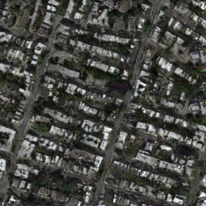
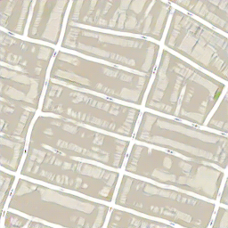

# pix2pix-tensorflow

# Result

## Shoes

*domain A and B* | *Output B* | *domain A and B* | *Output B* |
:---: | :---: |:---: | :---: |
 |  |  |  |
 |  |  |  |
 |  |  |  |
 |  |  |  |
 |  |  |  |

## Maps

*domain A and B* | *Output A* | *Output B*
:---: | :---: | :---: |
 |  | 
 |  | 
 |  | 
 |  | 
