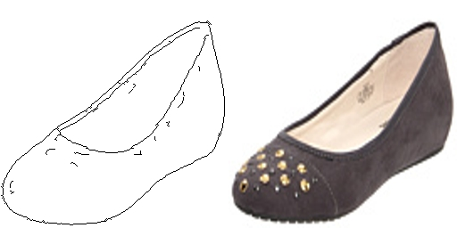
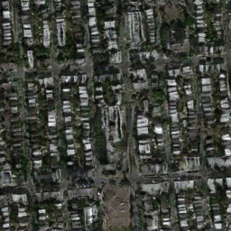

# pix2pix 
- Tensorflow implementation of [
Image-to-Image Translation with Conditional Adversarial Networks](https://arxiv.org/abs/1611.07004) (CVPR 2017)
- The conditional adversarial network is trained to learn the image-to-image mapping.
- The generator is a U-Net (a encoder-decoder with skip layers), since the input and output may share low level features for some tasks (i.e. image colorizaton).
- The discriminator is used to classify if a image patch is real or fake (PatchGAN). Because L1 loss forces the low-frequency correctness (blurred images) and it is sufficient for discriminator to focus on high-frequency structure locally. Then the output of discriminator is averaged over all the patches in the image. Another advantage of using PatchGAN is that it has fewer parameters than full size GAN and can be applied to arbitrary size images.
- Additional L1 loss is added to generator loss to make the generated image near the groundtruth. L1 loss is chosen because it is less encourage blurring images than L2 loss as mentioned in section 3.1 of the paper.

## Requirements
- Python 3.3+
- [Tensorflow 1.8](https://www.tensorflow.org/)
- [numpy](http://www.numpy.org/)
- [Scipy](https://www.scipy.org/)

## Implementation Details
- dropout

## Result on Validation Set
### Facades
*No* | *Domain A* | *Domain B* | *Output A* |
:-- | :---: | :---: |:---: |
1| |  |  |
2| |  |  |
3| |  |  |
4| |  |  |
5| |  |  |
6| |  |  |
7| |  |  |
8| |  |  |
9| |  |  |
10| |  |  |

### Shoes

*Domain A and B* | *Output B* | *Domain A and B* | *Output B* |
:---: | :---: |:---: | :---: |
 |  |  |  |
 |  |  |  |
 |  |  |  |
 |  |  |  |
 |  |  |  |

### Maps

*Domain A and B* | *Output A* | *Output B*
:---: | :---: | :---: |
 |  | 
 |  | 
 |  | 
 |  | 
